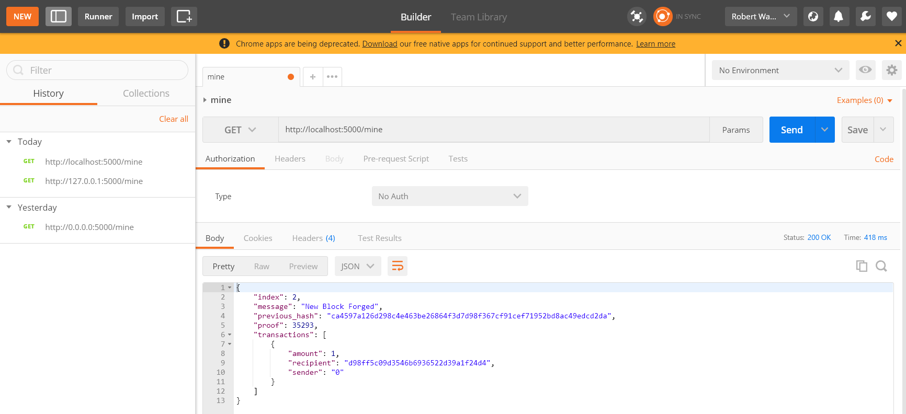
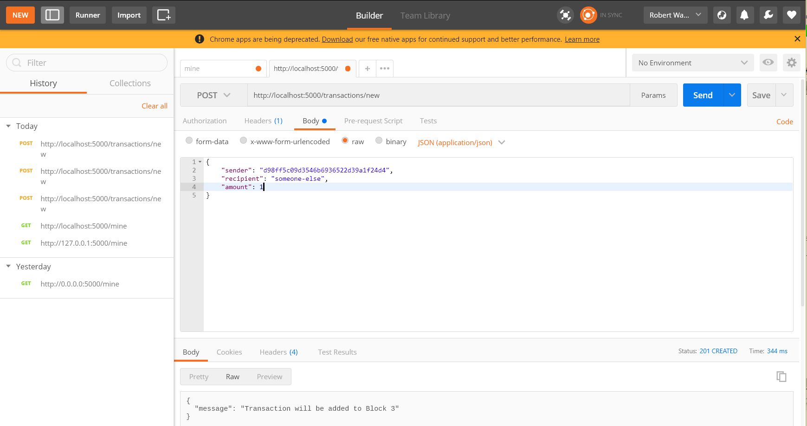
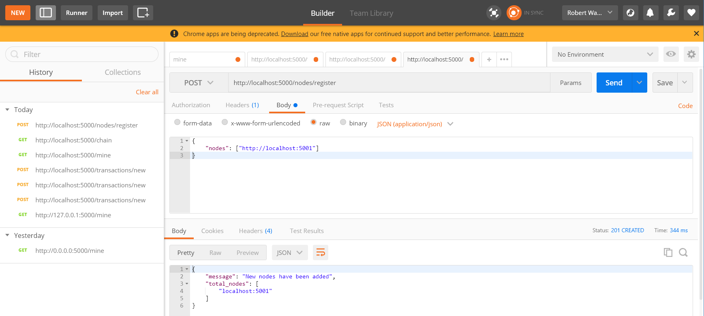
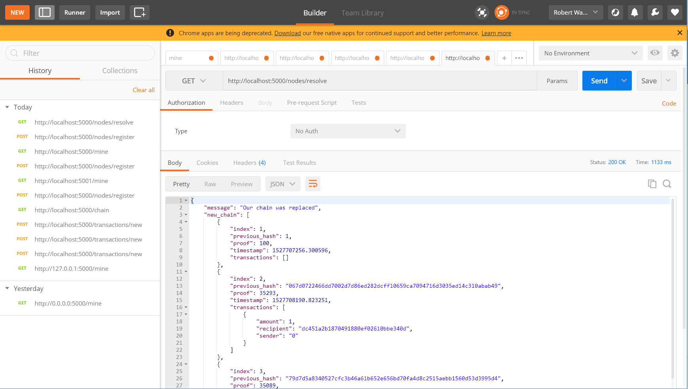

<h3 style="text-align:center;font-weight: 300;" align="center">
  
</h3>

<p align="center">
  
  
  
</p>


>

<!-- ## Features -->

## External Libraries

Third Party libraries used in this project

Package    |      Description
---------- | :--------------------:
`hashlib`  | SHA-256 Algorithm Core
`time` | Access real-time date
`json` | Speed up dictionary sorting
`uuid` | Globally unique id
`urllib` | Parse URL

<!-- ## Getting Started

### Run -->

<!-- ```bash
``` -->

## Code Walkthrough

#### Step 1: Creating Blockchain Class
In `class Blockchain`: a Blockchain object will contain a series of blocks within a single chain and another array to keep track of transactions. It should also have the ability to create a new block, keep track of new transactions, and provide a sophisticated hash algorithm.

```python
# Abstract Data Type of a Blockchain
class Blockchain(object):
    def __init__(self):
        self.chain = []
        self.current_transactions = []

    def new_block(self):
        # Creates a new Block and adds it to the chain
        pass

    def new_transaction(self):
        # Adds a new transaction to the list of transactions
        pass

    @staticmethod
    def hash(block):
        # Hashes a Block
        pass

    @property
    def last_block(self):
        # Returns the last Block in the chain
        pass
```

---

#### Step 2: Define a Block
A single `Block` consists of the following data: an `index`, a `timestamp` (in Unix time), a list of `transactions`, a `proof`(implemented later), and the `hash` of the previous Block.

Here is what a single entry looks like:
```python
block = {
    'index': 1,
    'timestamp': 1506057125.900785,
    'transactions': [
        {
            'sender': "8527147fe1f5426f9dd545de4b27ee00",
            'recipient': "a77f5cdfa2934df3954a5c7c7da5df1f",
            'amount': 5,
        }
    ],
    'proof': 324984774000,
    'previous_hash': "2cf24dba5fb0a30e26e83b2ac5b9e29e1b161e5c1fa7425e73043362938b9824"
}

```

---

#### Step 3: Adding Transactions to a Block

We will also need to feed `transactions` into each `Block`. The data is stored in `self.current_transactions`. The return value is the index of the block that will hold the transaction, which will be useful later.

```python
class Blockchain(object):
    ...

    def new_transaction(self, sender, recipient, amount):
        """
        Creates a new transaction to go into the next mined Block
        :param sender: <str> Address of the Sender
        :param recipient: <str> Address of the Recipient
        :param amount: <int> Amount
        :return: <int> The index of the Block that will hold this transaction
        """

        self.current_transactions.append({
            'sender': sender,
            'recipient': recipient,
            'amount': amount,
        })

        return self.last_block['index'] + 1
```
---

#### Step 4: Initialize a Genesis Block in Constructor

Each Blockchain needs to be initialized with a `Genesis Block` that other blocks can build upon. One thing to notice is that this block will have an arbitrary value for previous_hash because there is technically no previous_hash during its creation.

```python
class Blockchain(object):
    def __init__(self):
        self.current_transactions = []
        self.chain = []

        # Create the genesis block
        self.new_block(previous_hash=1, proof=100)
```

---

#### Step 5: Let's implement `new_block()`, `new_transaction()` and `hash()`

`new_block()`
Time to actually implement some behaviors for our Blockchain.
Recall from Step 2 on what a Block looks like. We will build new blocks based on the same model following a few rules:
1. Increment `index` as we go
2. Pass in current time. We use a function from `time` package to get real-life timestamp
3. Pass in `transactions` any transactions stored in `self.current_transactions`
4. Erase value inside of `self.current_transactions` array since this array only serves as a temporary array to hold transactions made since the creation of the last block.

```python
def new_block(self, proof, previous_hash=None):
    """
    Create a new Block in the Blockchain
    :param proof: <int> The proof given by the Proof of Work algorithm
    :param previous_hash: (Optional) <str> Hash of previous Block
    :return: <dict> New Block
    """

    block = {
        'index': len(self.chain) + 1,
        'timestamp': time(),
        'transactions': self.current_transactions,
        'proof': proof,
        'previous_hash': previous_hash or self.hash(self.chain[-1]),
    }

    # Reset the current list of transactions
    self.current_transactions = []

    self.chain.append(block)
    return block
```

`new_transaction()`
This is very self-explanatory,so we won't elaborate on this. This newly created transaction will later feed into `new_block`

```python
def new_transaction(self, sender, recipient, amount):
    """
    Creates a new transaction to go into the next mined Block
    :param sender: <str> Address of the Sender
    :param recipient: <str> Address of the Recipient
    :param amount: <int> Amount
    :return: <int> The index of the Block that will hold this transaction
    """

    self.current_transactions.append({
        'sender': sender,
        'recipient' : recipient,
        'amount' : amount,
    })

    return self.last_block['index'] + 1
```

`hash()`
Before feeding the string to our hashing algorithm, we need to sort the keys inside our dictionary because keys are generated in an arbitrary order, thus disrupting the output hash due to inconsistency.
We are using [SHA-256 Hashing Algorithm](https://www.youtube.com/watch?v=DMtFhACPnTY) to create hexadecimal string hash.

```python
@staticmethod
def hash(block):
    """
    Creates a SHA-256 hash of a Block
    Block String needs to be sorted for consistency, as key in dictionary genenarted
    in random order.
    :param block: <dict> Block
    :return: <str>
    """
    block_string = json.dumps(block, sort_keys=True).encode()
    return hashlib.sha256(block_string).hexdigest()
```

#### Step 6: Understanding Proof of Work

To understand Proof of Work (POW), read this [blog](https://medium.com/@karthik.seshu/cryptocurrency-proof-of-work-vs-proof-of-stake-e1eee1420b10). Quote from Karthik:

> Proof of Work (PoW) as the name states is the validation of the work that happened and proving it is correct. Bitcoin and many alt coins follow this way of consensus to make sure the authenticity of the chain is good.

> To understand how it works in simple terms, assume that you are in a math exam along with other students in a classroom. The student who can, not only come up with the correct answer but also can come up with the complete proof (steps in math terms) of arriving at the correct answer first gets the reward. As we know this needs the student with a lot of brain power which naturally consumes a lot of energy from the body.

Let's take a step back and think about our hashing function again. It's very easy for a `hash()` function to generate a hash based on an input because the output is consistent. however, It will cost miners a lot of computational power to use given output and reverse engineer back to the input.

for example, if the hash of some integer `x` multiplied by another `y` must end in 0. So, `hash(x * y) = ac23dc...0.` And for this simplified example, let’s fix x = 5. Implementing this in Python:

```python
from hashlib import sha256
x = 5
y = 0  # We don't know what y should be yet...
while sha256(f'{x*y}'.encode()).hexdigest()[-1] != "0":
    y += 1
print(f'The solution is y = {y}')
```

The solution here is `y = 21`. Since, the produced hash ends in 0:

```python
hash(5 * 21) = 1253e9373e...5e3600155e860
```

To recap: In Bitcoin, the Proof of Work algorithm is called *Hashcash*. And it’s not too different from our basic example above. It’s the algorithm that miners race to solve in order to create a new block. In general, the difficulty is determined by the number of characters searched for in a string. The miners are then rewarded for their solution by receiving a coin—in a transaction.

The network is able to **easily** verify their solution, but the process of reverse engineering takes up a lot of computational power.

Below is a basic implementation of POW:

```python
import hashlib
import json

from time import time
from uuid import uuid4


class Blockchain(object):
    ...

    def proof_of_work(self, last_proof):
        """
        Simple Proof of Work Algorithm:
         - Find a number p' such that hash(pp') contains leading 4 zeroes, where p is the previous p'
         - p is the previous proof, and p' is the new proof
        :param last_proof: <int>
        :return: <int>
        """

        proof = 0
        while self.valid_proof(last_proof, proof) is False:
            proof += 1

        return proof

    @staticmethod
    def valid_proof(last_proof, proof):
        """
        Validates the Proof: Does hash(last_proof, proof) contain 4 leading zeroes?
        :param last_proof: <int> Previous Proof
        :param proof: <int> Current Proof
        :return: <bool> True if correct, False if not.
        """

        guess = f'{last_proof}{proof}'.encode()
        guess_hash = hashlib.sha256(guess).hexdigest()
        return guess_hash[:4] == "0000"
```

#### Step 7: Setting up Flask
We're going to use the Python Flask Framework. This makes it easy to map endpoints to Python functions and allows us to talk to our blockchain over the web using HTTP requests.
We'll create three methods:
* `/transactions/new` to create a new transaction and add it to a block
* `/mine` to mine a new block
* `/chain` to return the full Blockchain

We instantiate our Flask Node with a random identifier. We instantiate our Blockchain object and create our endpoints. `/mine` and `/chain` are GET requests while `/transactions/new` is a POST request. Finally, we run the server on port 5000.
```python
import hashlib
import json
from textwrap import dedent
from time import time
from uuid import uuid4

from flask import Flask


class Blockchain(object):
    ...


# Instantiate our Node
app = Flask(__name__)

# Generate a globally unique address for this node
node_identifier = str(uuid4()).replace('-', '')

# Instantiate the Blockchain
blockchain = Blockchain()


@app.route('/mine', methods=['GET'])
def mine():
    return "We'll mine a new Block"
  
@app.route('/transactions/new', methods=['POST'])
def new_transaction():
    return "We'll add a new transaction"

@app.route('/chain', methods=['GET'])
def full_chain():
    response = {
        'chain': blockchain.chain,
        'length': len(blockchain.chain),
    }
    return jsonify(response), 200

if __name__ == '__main__':
    app.run(host='0.0.0.0', port=5000)
```    
    
#### Step 8: The Transactions Endpoint
This is what the request for a transaction will look like:
```
{
 "sender": "my address",
 "recipient": "someone else's address",
 "amount": 5
}
```
Since we have our class method for adding transactions to a block, we just need to invoke it in the transaction endpoint. We check that all required data are present in the post request. Then, we add the new transaction to the blockchain.

```python
import hashlib
import json
from textwrap import dedent
from time import time
from uuid import uuid4

from flask import Flask, jsonify, request

...

@app.route('/transactions/new', methods=['POST'])
def new_transaction():
    values = request.get_json()

    # Check that the required fields are in the POST'ed data
    required = ['sender', 'recipient', 'amount']
    if not all(k in values for k in required):
        return 'Missing values', 400

    # Create a new Transaction
    index = blockchain.new_transaction(values['sender'], values['recipient'], values['amount'])

    response = {'message': f'Transaction will be added to Block {index}'}
    return jsonify(response), 201
```

#### Step 9: The Mining Endpoint
This endpoint does three things:
* Calculates the Proof of Work (POW)
* Rewards the miner by adding a transaction giving the miner one coin
* Forges the new Block by adding it to the chain

```python
import hashlib
import json

from time import time
from uuid import uuid4

from flask import Flask, jsonify, request

...

@app.route('/mine', methods=['GET'])
def mine():
    # We run the proof of work algorithm to get the next proof...
    last_block = blockchain.last_block
    last_proof = last_block['proof']
    proof = blockchain.proof_of_work(last_proof)

    # We must receive a reward for finding the proof.
    # The sender is "0" to signify that this node has mined a new coin.
    blockchain.new_transaction(
        sender="0",
        recipient=node_identifier,
        amount=1,
    )

    # Forge the new Block by adding it to the chain
    previous_hash = blockchain.hash(last_block)
    block = blockchain.new_block(proof, previous_hash)

    response = {
        'message': "New Block Forged",
        'index': block['index'],
        'transactions': block['transactions'],
        'proof': block['proof'],
        'previous_hash': block['previous_hash'],
    }
    return jsonify(response), 200
```
At this point, you can interact with the blockchain API. See demo below for instructions and screenshots. 

#### Step 10: Consensus
We have a basic Blockchain that accepts transactions and lets us mine new Blocks. However, the main point of Blockchains is that they should be decentralized. When these Blockchains are decentralized, nodes must agree on the same Blockchain. To ensure nodes agree on a Blockchain, we'll need to implement a consensus algorithm.
Before we can implement a consensus algorithm, we need a way to let a node know about neighboring nodes in the network. Each node will need to keep a registry of other nodes in the network. Therefore, we'll need more endpoints:
* `/nodes/register` to accept a list of new nodes from the parameters in the URL
* `/nodes/resovle` to implement our consensus algorithm which resolves any conflicts to ensure a node has the correct chain
We'll need to modify our Blockchain's constructor and create a method for registering nodes

```python
...
from urllib.parse import urlparse
...


class Blockchain(object):
    def __init__(self):
        ...
        self.nodes = set()
        ...

    def register_node(self, address):
        """
        Add a new node to the list of nodes
        :param address: <str> Address of node. Eg. 'http://192.168.0.5:5000'
        :return: None
        """

        parsed_url = urlparse(address)
        self.nodes.add(parsed_url.netloc)
```        

#### Step 11: Implementing the Consensus Algorithm
When one node has a different blockchain than another node, we need to resolve it. We'll make the rule that the longest chain is authoritative. 
The method `valid_chain` checks whether a given blockchain is valid by verifying the hash and proof of work of each block in the blockchain.
The method `resolve_conflicts` checks each neighboring node, downloads their chains, and verifies them. The node replaces its blockchain with the longest valid blockchain found.
```python
...
import requests


class Blockchain(object)
    ...
    
    def valid_chain(self, chain):
        """
        Determine if a given blockchain is valid
        :param chain: <list> A blockchain
        :return: <bool> True if valid, False if not
        """

        last_block = chain[0]
        current_index = 1

        while current_index < len(chain):
            block = chain[current_index]
            print(f'{last_block}')
            print(f'{block}')
            print("\n-----------\n")
            # Check that the hash of the block is correct
            if block['previous_hash'] != self.hash(last_block):
                return False

            # Check that the Proof of Work is correct
            if not self.valid_proof(last_block['proof'], block['proof']):
                return False

            last_block = block
            current_index += 1

        return True

    def resolve_conflicts(self):
        """
        This is our Consensus Algorithm, it resolves conflicts
        by replacing our chain with the longest one in the network.
        :return: <bool> True if our chain was replaced, False if not
        """

        neighbours = self.nodes
        new_chain = None

        # We're only looking for chains longer than ours
        max_length = len(self.chain)

        # Grab and verify the chains from all the nodes in our network
        for node in neighbours:
            response = requests.get(f'http://{node}/chain')

            if response.status_code == 200:
                length = response.json()['length']
                chain = response.json()['chain']

                # Check if the length is longer and the chain is valid
                if length > max_length and self.valid_chain(chain):
                    max_length = length
                    new_chain = chain

        # Replace our chain if we discovered a new, valid chain longer than ours
        if new_chain:
            self.chain = new_chain
            return True

        return False
```

Finally, we register the two endpoints to our API for adding neighboring nodes and resolving conflicts

```python
@app.route('/nodes/register', methods=['POST'])
def register_nodes():
    values = request.get_json()

    nodes = values.get('nodes')
    if nodes is None:
        return "Error: Please supply a valid list of nodes", 400

    for node in nodes:
        blockchain.register_node(node)

    response = {
        'message': 'New nodes have been added',
        'total_nodes': list(blockchain.nodes),
    }
    return jsonify(response), 201


@app.route('/nodes/resolve', methods=['GET'])
def consensus():
    replaced = blockchain.resolve_conflicts()

    if replaced:
        response = {
            'message': 'Our chain was replaced',
            'new_chain': blockchain.chain
        }
    else:
        response = {
            'message': 'Our chain is authoritative',
            'chain': blockchain.chain
        }

    return jsonify(response), 200
```
At this point, you can run this node on another machine or run a another process on the same machine using a different port. See below for instructions and screenshots.

## Notes

🐌 **@staticmethod** is a method that belongs to a class but behaves exactly like a regular function, which doesn't take any first `arg` such as `self` or `class`.

```python
@staticmethod
def hash(block):
    #Hashes a Block
    pass
```

---

🍜 **@property** is a shortcut for creating read-only properties. which, in turn, is the simplified syntax for creating a `property` with just a getter.

```python
@property
def x(self):
    return self._x
```

is equivalent to

```python
def getx(self):
    return self._x
x = property(getx)
```

## Demo

#### Blockchain API on One Node
We can interact with the Blockchain after adding the first three endpoints, `/mine`, `/transactions/new`, and `/chain`.
First, we have to start the server: 
```bash
$ python blockchain.py
* Running on http://0.0.0.0:5000/ (Press CTRL+C to quit)
```

Let's mine a block by sending a GET request with Postman to http://localhost:5000/mine


We can create a new transaction by sending a POST request to http://localhost:5000/transactions/new with the transaction data. If you're using Postman, make sure to specify JSON (application/json) in the drop-down menu beside the body's data type.


We restarted the server, mined two blocks, and can view the full blockchain by sending a GET request to http://localhost:5000/chain
```
{
    "chain": [
        {
            "index": 1,
            "previous_hash": 1,
            "proof": 100,
            "timestamp": 1527706269.185605,
            "transactions": []
        },
        {
            "index": 2,
            "previous_hash": "01cbf5ba93195c5637c1861e51736466ee9efccabe9f8931449445aaa2fc1371",
            "proof": 35293,
            "timestamp": 1527706277.28505,
            "transactions": [
                {
                    "amount": 1,
                    "recipient": "f5d52fb583db49bcb0c9c2a51649b2bd",
                    "sender": "0"
                }
            ]
        },
        {
            "index": 3,
            "previous_hash": "ea09c486a6f390e106d76d81c961f83639ff1d4b0238189eef810d5db1722411",
            "proof": 35089,
            "timestamp": 1527706278.5041142,
            "transactions": [
                {
                    "amount": 1,
                    "recipient": "f5d52fb583db49bcb0c9c2a51649b2bd",
                    "sender": "0"
                }
            ]
        }
    ],
    "length": 3
}
```

#### Blockchain on Two Nodes
We can try out the decentralized version of our Blockchain by starting another process on a different port. I copied blockchain.py and changed the port to 5001.
Let the node on port 5000 be node A and the node on port 5001 be node B. First, we can register node B as a neighbor on node A.


We mined some blocks on node B to ensure its blockchain was longer than node A's. Then, we sent a GET request to /nodes/resolve on node A to replace its blockchain through the consensus algorithm.


## License

🌱 MIT 🌱

---


> 
[yuzhoujr.com](http://www.yuzhoujr.com) &nbsp;&middot;&nbsp;
>   [@yuzhoujr](https://github.com/yuzhoujr) &nbsp;&middot;&nbsp;
>   [@yuzhoujr](https://linkedin.com/in/yuzhoujr)
